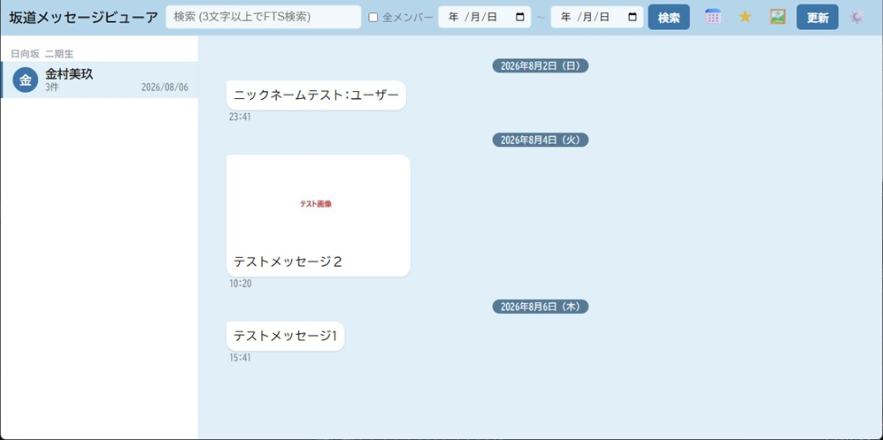

# 坂道メッセージビューア

colmsgを使用して時系列で蓄積されたメッセージ・画像・動画・音声ファイル群を、チャットアプリ風のWeb UIで閲覧・検索できるツール。
メッセージ保存フォルダ（読み取り専用）を走査してSQLiteインデックスを構築し、FastAPI製バックエンドがWeb UIに配信する。
保存フォルダの指定は初回起動時にWeb UI（設定アイコン &#9881;）から行う。`config.json` を直接編集する必要はない。



## 主な機能

- サイドバーによるメンバー（スレッド）一覧・切り替え
- 仮想スクロールによる大量メッセージの高速表示
- SQLite FTS5による全文検索
- カレンダーからの日付ジャンプ
- 画像・動画・音声のインライン表示（動画はRange対応でシーク再生可能）
- ライト/ダークのテーマ切り替え
- インデックス取り込み中の進捗バー表示

## 動作要件

- Python 3.x
- SQLite3（FTS5拡張が有効なビルドであること。多くのディストリの標準Python同梱SQLiteで動作）
- ffmpegは任意（動画サムネイル生成用）。無くても機能上の問題はない。詳細は [docs/ffmpeg.md](docs/ffmpeg.md) を参照
- 依存パッケージは `requirements.txt` を参照（FastAPI, Uvicorn, Pillow, python-multipart 等）

## セットアップ

事前にPythonのインストールと、`MoveFiles.bat` によるメッセージ保存フォルダの整形が必要。詳細・背景は [docs/setup.md](docs/setup.md) を参照。

```powershell
MoveFiles.bat "C:\messages"
```

**Windows ネイティブ（推奨）**

```powershell
cd \message-viewer
.\setup_venv_win.bat
```

**WSL / Linux**

```bash
cd /message-viewer
python3 -m venv venv
source venv/bin/activate
pip install -r requirements.txt
```

## バッチファイル一覧（Windows運用）

| コマンド | 説明 |
| --- | --- |
| `run_server.bat` | サーバ起動（app.py） |
| `run_rebuild.bat` | DBを作り直して全件走査 |
| `run_only_member.bat "メンバー名"` | 特定メンバーのみ取り込み |
| `run_thumbs.bat` | DBを保持したまま未生成のサムネイルのみ作成 |

詳細（ログの追記方式、二重起動検知など）は [docs/batch-files.md](docs/batch-files.md) を参照。

## 設定

保存フォルダ（`root`）が未設定なら、ブラウザで開いたときに設定ダイアログが自動表示される（設定アイコン &#9881; からいつでも変更可）。指定すると `config.json` に保存され、直後にバックグラウンドで取り込みが開始される。

`config.json` を直接編集することも可能（相対パスは `config.json` のあるディレクトリ基準）。

## 詳細ドキュメント

- [docs/cli.md](docs/cli.md) — CLI直接実行によるサーバ起動・インデックス構築、テスト
- [docs/api.md](docs/api.md) — APIエンドポイント一覧
- [docs/data-format.md](docs/data-format.md) — データ仕様

## ライセンス

[MIT License](LICENSE)
